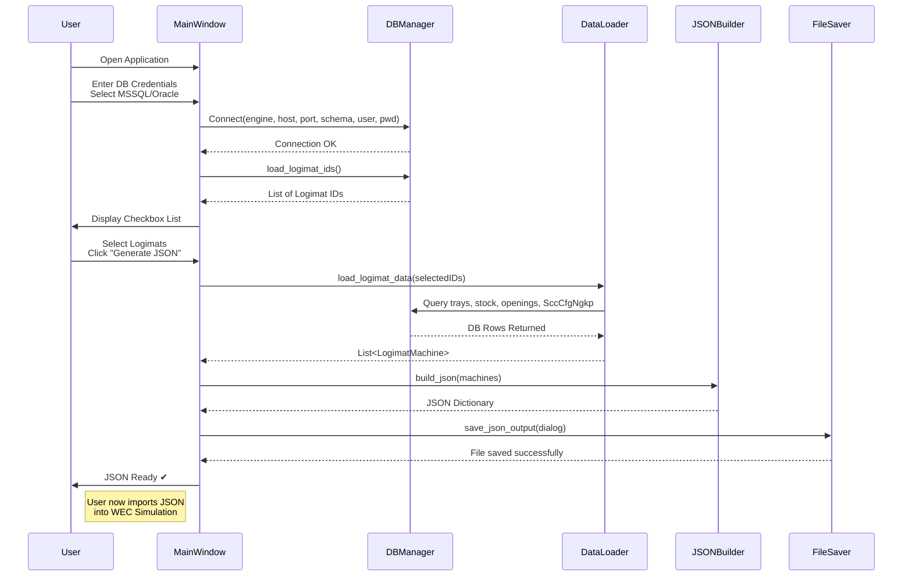

----------

# 📦 **Logimat WEC JSON Generator**

A cross‑platform **PySide6 desktop application** for generating **WEC Simulation JSON files** for **Kardex / SSI Schaefer Logimat** systems based on production **WAMAS** database tables.

This tool connects to **MSSQL** or **Oracle**, retrieves all Logimat‑related master data, applies all business rules defined by your operational requirements, and outputs a **fully valid WEC JSON configuration** matching the structure used in _logimat_pbl.json_.

----------

# 🚀 Features

### ✔ Connects to **MSSQL** or **Oracle**

-   Auto-handles connection strings
-   Supports Oracle Listener / Service Name
-   Supports SQL Server ODBC Driver 17

### ✔ Dynamic Logimat detection

Automatically pulls distinct Logimat IDs from:

-   `LogimatLuExt`
-   `StockObjectBundle`
-   `LogimatOpening`
-   `SccCfgNgkp`

### ✔ Checkbox selection interface

Choose exactly which Logimat units to include in the JSON.

### ✔ Fully automated JSON generation

Implements all custom business rules, including:

-   `posx` starts at **-5**, increments by **+3**
-   `posy = -58.5`
-   `supportsFront = supportsRear = 1000`
-   Tray dimensions from **grossDimension_x/y/z_value**
-   maxLoad extracted from **loadAidId prefix** (`310Txxxx`)
-   Sender/Receiver IDs and ports from **SccCfgNgkp**
-   Ignore trays in **LogimatExt**
-   Openings sorted by **openingNo → rackSide**
-   Opening absolute positions:
    -   First opening: 800
    -   Next on same rackSide: +2100 per stack
-   PLC IDs assigned sequentially
-   Maximum Height/Weight = **600**

### ✔ Exports WEC JSON

Saves a single consolidated JSON file containing all selected Logimat entities.

----------

# 🗂 Project Structure

```
logimat_wec_generator/
│
├── main.py
│
├── gui/
│   ├── __init__.py
│   ├── main_window.py
│   └── logimat_selector_widget.py
│
├── db/
│   ├── __init__.py
│   ├── db_manager.py
│   ├── oracle_connector.py
│   ├── mssql_connector.py
│   └── queries.py
│
├── model/
│   ├── __init__.py
│   ├── logimat_machine.py
│   ├── tray.py
│   ├── opening.py
│   └── loader.py
│
├── generator/
│   ├── __init__.py
│   ├── json_builder.py
│   └── wec_output.py
│
└── utils/
    ├── __init__.py
    ├── constants.py
    └── parser.py

```

----------

# 🛠 Requirements

Install Python dependencies:

```
pip install PySide6
pip install cx-Oracle
pip install pyodbc

```

### Additional system software

#### **Oracle Database**

-   Install **Oracle Instant Client**
-   Add Instant Client folder to:
    -   `PATH` (Windows)
    -   `LD_LIBRARY_PATH` (Linux)

#### **SQL Server**

-   Install **ODBC Driver 17 for SQL Server**
-   Windows:  
    https://learn.microsoft.com/en-us/sql/connect/odbc/windows/installing-the-microsoft-odbc-driver-for-sql-server

----------

# ▶️ How to Run

Inside the `logimat_wec_generator/` folder:

```
python main.py

```

### Steps in GUI:

1.  Select **MSSQL** or **ORACLE**
2.  Enter host, port, schema, username, password
3.  Click **Connect to Database**
4.  Select desired Logimat IDs from the checkbox list
5.  Click **Generate JSON**
6.  Save the file (default name: `logimat_wec.json`)

----------

# 📘 JSON Generation Rules (Business Logic Summary)

### Machine Placement

-   `posx`: -5, -2, 1, 4, ...
-   `posy`: always -58.5

### Communication

Values pulled from `SccCfgNgkp`:

-   `senderId = destAddrSoc`
-   `receiverId = destAddrWamas`
-   Ports from `portSoc2Wamas` and `portWamas2Soc`

### Trays

-   Read from **LogimatLuExt** + **StockObjectBundle**
-   Ignore `stoLoc_stoLocId = 'LogimatExt'`
-   Extract:
    -   `trayWidth = grossDimension_x_value`
    -   `trayLength = grossDimension_y_value`
    -   `trayHeight = grossDimension_z_value`
-   Parse stoLoc into:
    -   Logimat ID
    -   `originalRackSide`
    -   `originalSupportNo`
-   Extract `maxLoad` from prefix of `loadAidId` (e.g. `310T3025x815` → 310)

### Openings

-   Use rackSide from DB
-   Order by:
    1.  `openingNo`
    2.  `rackSide`
-   Compute absolutePosition:
    
    ```
    800 + 2100 * stack_index
    
    ```
    

----------
## ⚙️ Optional Oracle Support

This application supports **both MSSQL and Oracle**, but **Oracle connectivity is optional**.  
If the required Oracle components are not installed, the application will:

-   Automatically **hide the “Oracle” option** from the database engine dropdown
-   Display a **diagnostic message** if the user tries to select Oracle through any other means
-   Still run MSSQL mode perfectly without any Oracle dependencies

### ✔ MSSQL works out‑of‑the‑box

No extra runtime software required.

### ✔ Oracle works only if one of the following is installed:

### **Option A — cx_Oracle + Oracle Instant Client (recommended for production)**

Install Oracle Instant Client manually:

1.  Download Instant Client from Oracle
2.  Add its folder to `PATH` (Windows) or `LD_LIBRARY_PATH` (Linux)
3.  Install Python driver:

```
pip install cx-Oracle

```

### **Option B — `python-oracledb` (Thin mode) — no Instant Client required**

This mode provides pure‑Python Oracle connectivity:

```
pip install oracledb

```

Thin mode works without Oracle Instant Client, but:

-   Some advanced OCI features may not be available
-   Performance is slightly slower than OCI mode

If `cx_Oracle` is not detected, the app automatically attempts thin-mode via `oracledb`.

### ✔ If neither driver is installed

Oracle support is simply disabled, and the app still runs normally with MSSQL.

----------

# 📦 Packaging (PyInstaller)

To create a standalone EXE:

```
pyinstaller --onefile --windowed main.py

```

Or a folder bundle:

```
pyinstaller --onedir --windowed main.py

```

The EXE will appear inside the `dist/` folder.

----------

# 🧪 Validation Checklist

Before deploying, verify:

-   ✔ Connection succeeds
-   ✔ Logimat list loads correctly
-   ✔ Trays all have correct dimensions
-   ✔ No `LogimatExt` trays included
-   ✔ Openings appear with correct rackSide and position
-   ✔ Generated JSON loads in WEC Simulator without errors

----------

# 📝 **Explanation of the Architecture**

### **1. GUI Layer (User Interface)**

Component

Purpose

**main_window.py**

Database input, Logimat selection, “Generate JSON” workflow

**logimat_selector_widget.py**

Checkbox list of dynamic Logimat IDs

----------

### **2. Database Layer**

File

Description

**db_manager.py**

Central router for SQL queries (MSSQL/Oracle)

**oracle_connector.py**

cx_Oracle implementation

**mssql_connector.py**

pyodbc implementation

**queries.py**

All SQL statements for: Logimat, trays, openings, SccCfgNgkp

----------

### **3. Model Layer**

File

Description

**logimat_machine.py**

Represents a complete Logimat simulation entity

**tray.py**

Tray model (dimensions, loadAidId, support positions, etc.)

**opening.py**

Opening model (rackside, absolutePosition, etc.)

**loader.py**

Orchestrates DB → model assembly using all rules

----------

### **4. Utils Layer**

File

Purpose

**parser.py**

Parses stoLocId (“A1‑1‑001”), loadAidId maxLoad, safe conversions

**constants.py**

All fixed values: speed, posy, supportDistance, etc.

----------

### **5. JSON Generator Layer**

File

Purpose

**json_builder.py**

Converts model → WEC JSON format

**wec_output.py**

Save dialog and JSON serialization

----------

### **6. Flow Summary**

1.  User configures DB connection
2.  DBManager establishes Oracle/MSSQL session
3.  LogimatSelectorWidget shows machine IDs
4.  User selects machines → click Generate
5.  LogimatDataLoader loads trays, openings, SccCfgNgkp details
6.  JSON Builder constructs full WEC JSON
7.  Output saved to user-chosen file
----------
🧭 System Architecture Diagram

----------
# 📝 License

Internal custom tool